<p align="center">
  
</p>

<p align="center">
  
</p>

<p align="center">
  <a href="https://getkodiak.dev"></a>
  <a href="https://www.linkedin.com/in/alfonsomendez-dev"></a>
  <a href="mailto:alfonsomndz12@gmail.com"></a>
</p>

---

### `$ ls ~/proyectos --destacados`

<table>
  <tr>
    <td width="50%" valign="top">
      <b><a href="https://github.com/meyern01/el-mezquite-pos">el-mezquite-pos/</a></b><br/>
      Landing + punto de venta con 3 pantallas (caja, cocina, repartidor) sincronizadas en tiempo real para un negocio de comida en operación.<br/>
      <sub><i>Real-time 3-screen POS + public site for a live food business.</i></sub><br/><br/>
      <code>Next.js</code> <code>Supabase Realtime</code> <code>Vercel</code><br/><br/>
      <a href="https://mezquite-dk-theta.vercel.app"></a>
    </td>
    <td width="50%" valign="top">
      <b><a href="https://github.com/meyern01/arabsa-b2b-platform">arabsa-b2b-platform/</a></b><br/>
      Plataforma B2B que reemplaza las cotizaciones por teléfono y WhatsApp: roles, crédito y facturación, catálogos PDF y métricas en tiempo real.<br/>
      <sub><i>B2B quoting & invoicing SaaS with role-based access.</i></sub><br/><br/>
      <code>Next.js 16</code> <code>PostgreSQL + RLS</code> <code>GitHub Actions</code><br/><br/>
      
    </td>
  </tr>
  <tr>
    <td width="50%" valign="top">
      <b><a href="https://github.com/meyern01/barberia-booking-saas">barberia-booking-saas/</a></b><br/>
      Reservas en tiempo real con bot de WhatsApp, recordatorios automáticos, prevención de doble reservación y dashboard financiero.<br/>
      <sub><i>Real-time booking with a WhatsApp bot and financial dashboard.</i></sub><br/><br/>
      <code>Next.js 14</code> <code>WhatsApp Cloud API</code> <code>Vercel Cron</code><br/><br/>
      <a href="https://barberia-fonseca.vercel.app"></a>
    </td>
    <td width="50%" valign="top">
      <b><a href="https://github.com/meyern01/leyva-fitness-platform">leyva-fitness-platform/</a></b><br/>
      Portal dual entrenador/cliente con autenticación independiente, seguridad "deny-all" y cálculo automático de macros.<br/>
      <sub><i>Dual-portal coaching app with deny-all security.</i></sub><br/><br/>
      <code>React + Vite</code> <code>Edge Functions (Deno)</code> <code>JWT</code><br/><br/>
      
    </td>
  </tr>
  <tr>
    <td colspan="2" valign="top">
      <b><a href="https://github.com/meyern01/kodiak-website">kodiak-website/</a></b> &nbsp;—&nbsp; Sitio de mi empresa de desarrollo de software: animaciones scroll-driven, componentes accesibles y formulario de cotización. <sub><i>My software company's website.</i></sub><br/><br/>
      <code>Next.js</code> <code>TypeScript</code> <code>Tailwind v4</code> <code>GSAP</code> &nbsp;
      <a href="https://getkodiak.dev"></a>
    </td>
  </tr>
</table>

### `$ ls ~/proyectos --otros`

| repo | qué es · what it is | stack |
|---|---|---|
| `lattice` | App móvil de fitness: rutinas, comidas, registros corporales y fotos de progreso · *Fitness mobile app* | `React Native` `Expo` `Supabase` |
| `bitacora-plus` | App móvil offline-first para transportistas: viajes, gastos, metas y reportes PDF · *Offline-first trucking app* | `React Native` `Expo` `SQLite` |
| `stael-app` | Gestión de taller de reparación: tickets, estados y comprobantes PDF · *Repair shop management* | `React` `Zustand` `Supabase` |
| `captura-vacunas` | Digitaliza la captura del formato de vacunación desde el celular · *Mobile-first vaccination records* | `Next.js` `Supabase` `pdf-lib` |
| [`OaxacoBOT`](https://github.com/meyern01/OaxacoBOT) | Bot de Discord con música, moderación, niveles, tickets y panel web · *All-in-one Discord bot* | `Node.js` `discord.js` |

### `$ stack --icons`

<p align="center">
  
</p>

### `$ cat contacto.txt`

```text
> ¿Tienes un proyecto?  Cotiza en  https://getkodiak.dev
> Have a project?       Get a quote at https://getkodiak.dev
> alfonsomndz12@gmail.com  ·  linkedin.com/in/alfonsomendez-dev
```
